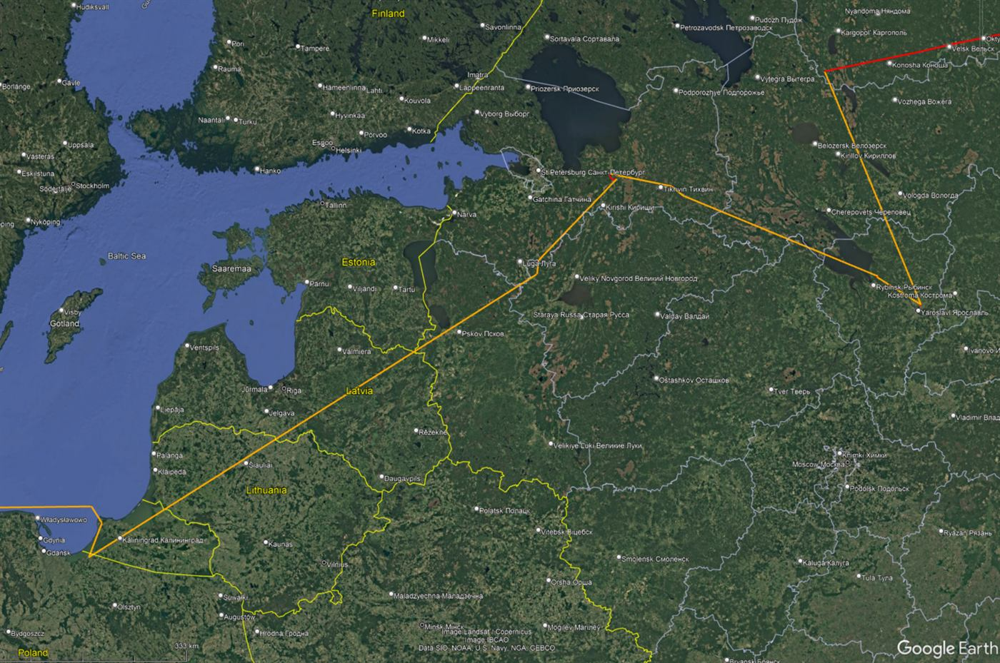

# MU771 PVG-AMS, 2026-05-26

Smartphone GNSS recording during China Eastern flight MU771 from Shanghai Pudong (PVG) to Amsterdam Schiphol (AMS) on 2026-05-26.

This is a consumer-device recording from inside an aircraft cabin. It is not aircraft avionics data and should not be treated as certified navigation evidence. The track contains ordinary cabin-reception artifacts, but also two consecutive GNSS timestamp blocks with clearly wrong dates.

## Files

| File | Description |
| --- | --- |
| `data/20260526-123011.gpx` | Original GPX track with timestamps, position, altitude, speed, and satellite fields where recorded |
| `screenshots/phone-local-20260526-152406-CEST_gps-status_time-jump.png` | Phone screenshot near the `2026-05-20` timestamp anomaly; GPS Status overlay over MAPS.ME |
| `screenshots/phone-local-20260526-165223-CEST_gps-status_baltic.png` | Phone screenshot near the Baltic / Kaliningrad area; GPS Status overlay over MAPS.ME |
| `maps/google-earth-anomaly-overview.jpg` | Google Earth overview of the main anomaly area |
| `maps/google-earth-nw-russia-detail.jpg` | Google Earth detail view of the NW Russia / St. Petersburg / Yaroslavl area |
| `maps/google-earth-fix-loops-yaroslavl.jpg` | Google Earth close-up showing loop-like fixes near the Yaroslavl / Rybinsk area |
| `maps/google-earth-kaliningrad-detail.jpg` | Google Earth detail view of the Baltic / Kaliningrad area |

In the Google Earth images, red lines are time-continuous GPX segments. Orange lines connect segment endpoints across time gaps or timestamp discontinuities and are not continuous recorded movement.

Phone screenshots use the Android app [GPS Status](https://play.google.com/store/apps/details?id=com.eclipsim.gpsstatus2) for the GNSS overlay. Map backgrounds visible in phone screenshots are from MAPS.ME / OpenStreetMap. Google Earth imagery is included only as visual context and remains subject to Google's terms and attribution requirements.

## Summary

- Flight: China Eastern MU771, PVG to AMS
- Recording device/context: Sony Xperia 10 V smartphone GNSS recording inside the cabin
- GPX points: 8642
- First GPX timestamp: `2026-05-26T04:30:11Z`
- Last GPX timestamp: `2026-05-26T16:27:12Z`
- Normal-date points: 8543 points on `2026-05-26`
- Wrong-date block 1: 62 consecutive points on `2026-05-20`
- Wrong-date block 2: 37 consecutive points on `2045-12-13`

The GPX timestamps are UTC. Phone screenshots, if included, may show CEST / UTC+2 local time.

## Timestamp Runs

| File-order range | Count | GPX date | First GPX time | Last GPX time | Approx. position range | Altitude range |
| ---: | ---: | --- | --- | --- | --- | ---: |
| 0-8285 | 8286 | 2026-05-26 | `2026-05-26T04:30:11Z` | `2026-05-26T13:20:44Z` | 30.96-61.28N, 38.43-121.83E | 10-9989 m |
| 8286-8347 | 62 | 2026-05-20 | `2026-05-20T00:19:24Z` | `2026-05-20T00:06:00Z` | 59.51-59.65N, 33.90-34.17E | 1141-2607 m |
| 8348-8561 | 214 | 2026-05-26 | `2026-05-26T13:29:15Z` | `2026-05-26T14:25:43Z` | 54.38-59.85N, 19.81-32.47E | 125-2975 m |
| 8562-8598 | 37 | 2045-12-13 | `2045-12-13T00:42:01Z` | `2045-12-13T00:51:11Z` | 54.88-55.09N, 19.73-20.04E | 2200-2800 m |
| 8599-8641 | 43 | 2026-05-26 | `2026-05-26T16:24:16Z` | `2026-05-26T16:27:12Z` | 52.31N, 4.77E | 76-90 m |

Note: the wrong-date runs are listed in GPX file order. Their timestamps are not interpreted as real UTC times.

## Selected Points

| GPX time / file-order segment | Position | Altitude | Note |
| --- | --- | ---: | --- |
| `2026-05-26T13:03:48Z` | 60.9767N, 38.4251E | 9436.6 m | Plausible cruise segment |
| `2026-05-26T13:05:30Z` | 57.6962N, 40.0409E | 978.3 m | Jump of about 376.1 km from previous point |
| `2026-05-26T13:05Z-13:20Z` | Yaroslavl / Rybinsk area | about 980-1000 m | Stable but false-looking movement around 100 km/h |
| immediately after `2026-05-26T13:20:44Z` in file order | 59.51-59.65N, 33.90-34.17E | 1141-2607 m | GNSS date becomes `2026-05-20`; 62 consecutive points |
| `2026-05-26T13:29:15Z` | 59.85N, 32.31E | 125.1 m | Normal date returns, but altitude remains implausible |
| `2026-05-26T13:41:41Z` | 58.75N, 30.39E | 2117.2 m | Another large jump |
| `2026-05-26T14:25:04Z` | 54.38N, 19.81E | 959.0 m | Baltic / Kaliningrad-area jump of about 794.2 km from previous point |
| immediately after `2026-05-26T14:25:43Z` in file order | 54.88-55.09N, 19.73-20.04E | 2200-2800 m | GNSS date becomes `2045-12-13`; 37 consecutive points |
| `2026-05-26T16:24:16Z` | Amsterdam area, 52.31N, 4.77E | 90.1 m | Return to plausible arrival position/date |

## Interpretation Notes

The data is clearly not the real aircraft trajectory in the anomalous sections. The main question is the likely failure mode, not whether the aircraft actually flew the recorded path.

Open questions:

- Does this pattern look more like spoofing, jamming followed by bad reacquisition, receiver/app fallback behavior, or something else?
- Can GNSS interference produce a sequence where position, altitude, speed, and GNSS time are all wrong but internally consistent for dozens of fixes?
- Are the dates `2026-05-20` and `2045-12-13` meaningful in any known GNSS failure mode, or are they likely receiver/app artifacts after losing a trustworthy solution?

