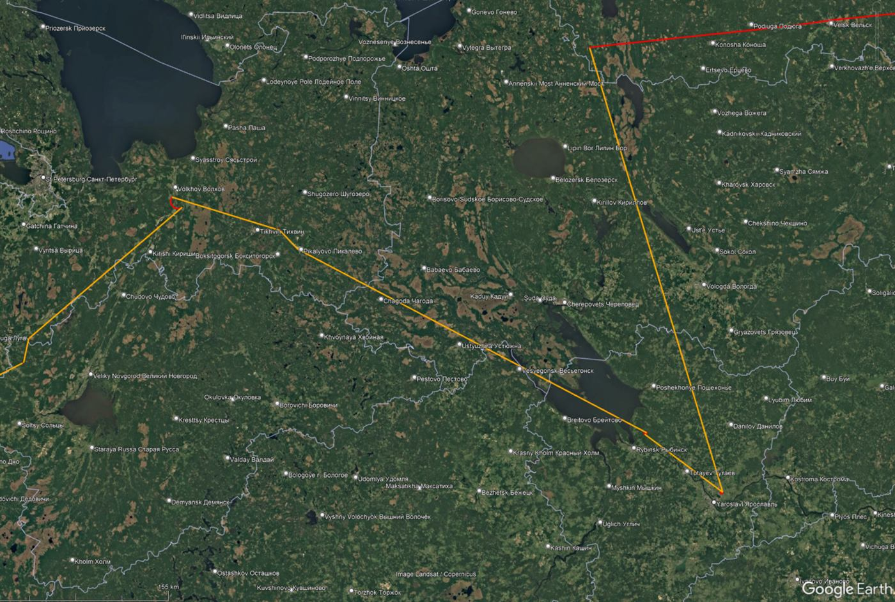
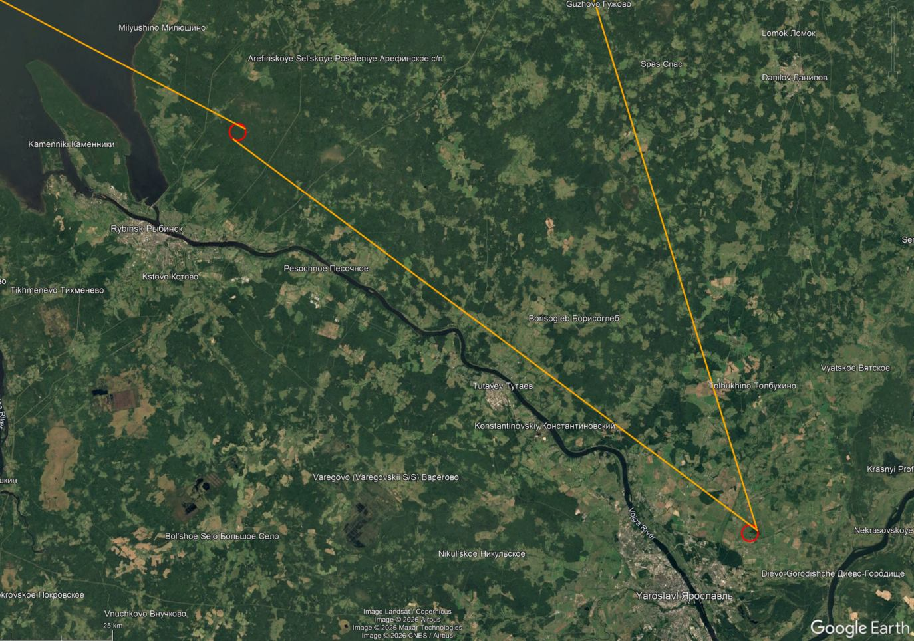
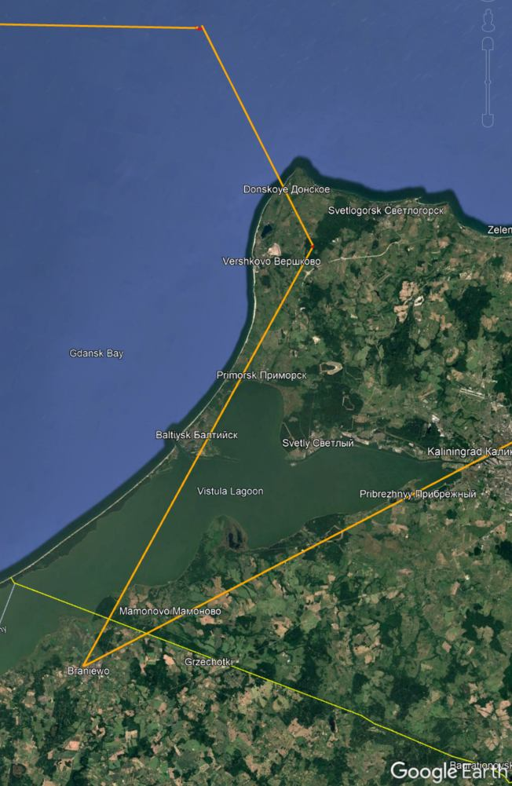

# Map Images

Google Earth views of the recorded GPX track and selected anomaly areas.

Red lines are time-continuous GPX segments. Orange lines connect segment endpoints across time gaps or timestamp discontinuities and are not continuous recorded movement.

| Image | Description |
| --- | --- |
|  | Overview of the main anomaly area |
|  | Detail view of the NW Russia / St. Petersburg / Yaroslavl area |
|  | Close-up showing loop-like fixes near the Yaroslavl / Rybinsk area |
|  | Detail view of the Baltic / Kaliningrad area |
